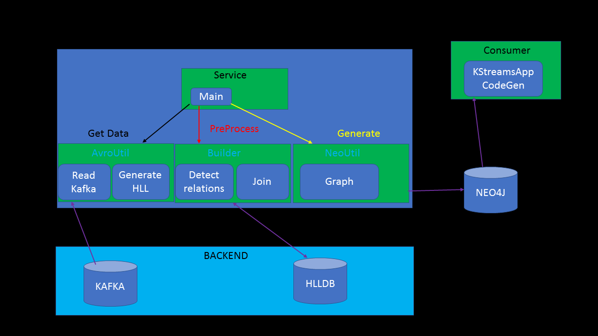
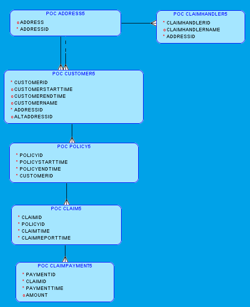
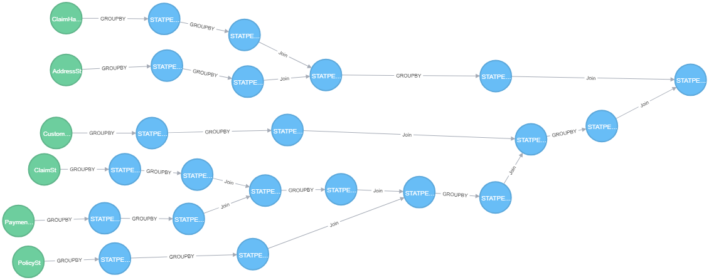

# Nereus
#### *Part of the Tryg Cloud Project 2018*
### 0.0 Introduction
This repository contains all documentation and code for generating graphs describing data flow of 
KStreams data pipelines. It is based on dummy data. The graph is represented as property graph
in Neo4j and is used as input for auto generating of ETL pipelines on Kafka. 

### 1.0 Frame The Problem
#### 1.1 Variety of data sources
The dummy data is designed to illustrate a simple data model, describing the claims and payment
life-cycle for a customer portfolio. The framework tries to detect entity relationships
in the input data. Once that is achieved, it suggests a number of operations 
like groupBy or join, dictated by the underlying framework of KStreams.
 
 Although the number of entities is limited by the PoC 
it could potentially be hundreds. 
#### 1.2 Business Case
The framework tries to automate series of manual and potentially tedious steps of linking
single entities into coherent datasets. 
#### 1.3 Scope
The aim of this project is to demonstrate ability of reading data from variety of Kafka
topics, find the underlying relationships between these entities and join them into
coherent KTables, used by analytical services. 

For the purpose of entity relationships detection we use HyperLogLog(HLL) algorithm.
HLL is an algorithm for the count-distinct problem, approximating the number of distinct
elements in a set. 
### 2.0 Infrastructure
Application is written in Java and requires Java8. 
###### 2.1 Schema registry
Schema registry repo URL is set in  ```ConfluentBasedSchemaRegistry.java ```. 

```
	public ConfluentBasedSchemaRegistry(AttunityMessageDecoder messageDecoder) {
		this.decoder = messageDecoder;
		this.schemaRegistryBean = new ConfluentSchemaRegBean();
		this.schemaRegImpl = new ConfluentSchemaRegistryHandlerImpl();
		this.schemaRegistryBean.setRepoURL("http://10.84.0.5:8081");
	}
```
###### 2.2 Kafka 
Kafka related properties in  ```KafkaUtilities.java ```. 
```
	public static Properties getKafkaProducer1Properties() {
		Properties properties = new Properties();
		properties.put("bootstrap.servers",
				"wn0-kaf001.si34agdvrydetneynufspu4j5a.fx.internal.cloudapp.net:9092,wn1-kaf001.si34agdvrydetneynufspu4j5a.fx.internal.cloudapp.net:9092,wn2-kaf001.si34agdvrydetneynufspu4j5a.fx.internal.cloudapp.net:9092,wn3-kaf001.si34agdvrydetneynufspu4j5a.fx.internal.cloudapp.net:9092");
		properties.put("key.serializer", "org.apache.kafka.common.serialization.StringSerializer");
		properties.put("value.serializer", "org.apache.kafka.common.serialization.StringSerializer");
		return properties;
	}
```
Source Kafka topics in  ```HLLDB.java```. For version 5 of data the topics are as follows:
```
 public static final String CUSTOMER_TOPIC ="STATPEJ.POC_CUSTOMER5";
 public static final String POLICY_TOPIC ="STATPEJ.POC_POLICY5";
 public static final String CLAIM_TOPIC  = "STATPEJ.POC_CLAIM5";
 public static final String PAYMENT_TOPIC = "STATPEJ.POC_CLAIMPAYMENT5";
 public static final String ADDRESS_TOPIC = "STATPEJ.POC_ADDRESS5";
 public static final String CLAIMHANDLER_TOPIC = "STATPEJ.POC_CLAIMHANDLER5";
```
###### 2.3 Neo4j 
Noe4j properties in  ```NeoUtils.java ```.
```
  Driver driver = GraphDatabase.driver(
               "bolt://localhost:7687", AuthTokens.basic("user", "password"));
        Session session = driver.session();
```
### 3.0 Graphs Generating Framework
###### 3.1 Framework overview
 

*Modules and processes*

An arbitrary sample of data is read from Kafka in Avro format. Base on tha data a number of 
HLL objects are generated. Classes responsible for that workload are located in `src/main/java/com/nereus/avro`
package. 

Input from AvroUtils module is passed to Builder class that has only two tasks. Detecting 
entity relationships and suggesting plausible joins. 

Based on the metadata in the backend, a graph is genereated, as input for Kstreams applications generator.

HLLDB is currently stored in bunch of static variables in memory, but it really makes sense to create
a proper backend solution like for example Postgres. It will add traceability and transparency
to the process of generating graphs. 

###### 3.3 Good Coding Practices
The programm attempts to embrace functional programming paradigm and ideas from "Clean
Code: A Handbook of Agile Software Craftsmanship by Robert C. Martin" 

Functions are intentionally kept "pure" meaning that they don't have side-effects. They can 
be written, tested, reasoned about and debugged in isolation, without the need to understand
external context or history of events surrounding its execution. 

Pure task, contrarily to a pure function is typically not returning anything. 
They should be deterministic and idempotent, meaning that they will produce the same result every time it runs or re-runs.
Rexecuting a pure task with the same input parameters should overwrite any previous output. 

Parallelization, however is not considered in the scope this PoC. Pure tasks should be implemented in a way that
instances don't interfere with each other.  

 
Instead of creating a overly complex program that solves a given problem perfectly but is hostile 
towards any changes in the future, the framework tries to anticipate the necessity of modification
and replacing of the modules.

 

Some of principles used:

Functions
- Must be small (ideally max 20 lines)
- Should do only one thing
- Should not have side effects
- Should respect Command Query Separation(Functions should either do something or answer
something, but not both) 

Reproducibility
- Immutable data(append-only) along with versioned logic
- Pure tasks

### 4.0 Data.
Version 5 of data consists of 6 entities. 
###### 4.1 Data model.
 
###### 4.2 Graph.



 